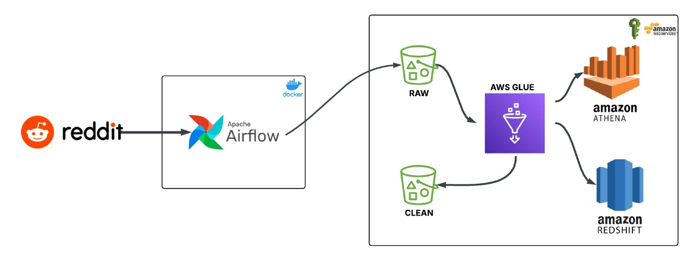

# Reddit Data Pipeline: End-to-End ETL Workflow using Airflow, AWS Glue, and Redshift for Social Media Analytics

This project demonstrates a modular ETL workflow where Reddit data is extracted using Python and orchestrated via Apache Airflow until it's loaded into Amazon S3. Subsequent transformation and analytics steps are carried out using AWS Glue, Athena, and Redshift.

---

## 🚀 Project Overview

### 🔹 Steps Involved & Architecture:


1. **Data Extraction & Load to S3 (Orchestrated by Airflow)**

   * Extracts Reddit posts using Reddit API (via PRAW).
   * Uploads raw data to Amazon S3 in `.csv` format.
   * Orchestrated using Apache Airflow.

2. **Data Transformation (Manual Trigger or Scheduled via AWS Console)**

   * AWS Glue cleans and normalizes raw Reddit data.
   * Transformed dataset is stored back into S3.

3. **Schema Cataloging & Querying**

   * AWS Glue Crawler catalogs the transformed dataset.
   * Amazon Athena used for ad-hoc queries on curated data.

4. **Loading to Redshift**

   * Final, curated dataset is loaded into Amazon Redshift for analytics.

---

## 🛠️ Tech Stack

* **Python** (with `praw` for Reddit API)
* **Apache Airflow** – Orchestrates extraction and S3 upload
* **Amazon S3** – Data lake (raw & transformed zones)
* **AWS Glue** – Serverless ETL job for transformation
* **Glue Crawler** – For schema discovery
* **Amazon Athena** – SQL-like queries over S3
* **Amazon Redshift** – Analytics and BI-ready storage
* **IAM** – Secure, role-based access between services


## ✅ Prerequisites

* AWS account with:

  * S3 bucket (raw and curated zones)
  * IAM roles for S3, Glue, Athena, Redshift
  * Redshift cluster + table
* Reddit API credentials from [Reddit Developer Console](https://www.reddit.com/prefs/apps)
* Airflow installed and running locally or in the cloud

---

## 🔧 Setup Instructions

1. **Clone the repo:**

   ```bash
   git clone https://github.com/yourusername/Reddit-ETL-Airflow-Glue-Redshift.git
   cd Reddit-ETL-Airflow-Glue-Redshift
   ```

2. **Install dependencies:**

   ```bash
   pip install -r requirements.txt
   ```

3. **Configure credentials:**

   * Add your **Reddit API keys** in the Airflow DAG script or `.env` file (as applicable)
   * Ensure your **AWS credentials** are set via `~/.aws/credentials` or environment variables

4. **Start Apache Airflow via Docker Compose:**

   ```bash
   docker-compose up -d
   ```

   This will spin up Airflow in containers with a web UI at `http://localhost:8080`.

5. **Trigger the Airflow DAG:**

   * Access Airflow UI
   * Trigger the `reddit_to_s3_dag`
   * This will extract Reddit data and upload it to your **raw S3 bucket**

6. **Run the AWS Glue Job:**

   * Go to AWS Glue Console → **Scripts**
   * Paste the transformation code from `redit_etl_jobs_drop_column.py`
   * Configure input (raw S3 path) and output (cleaned S3 path)
   * Run the job to produce a cleaned dataset

7. **Run AWS Glue Crawler:**

   * Create and run a crawler to scan the **cleaned S3 location**
   * It will create a table in the Glue Data Catalog

8. **Query Cleaned Data in Athena:**

   * Go to **Amazon Athena**
   * Choose the database created by the crawler
   * Write SQL queries to explore the cleaned Reddit data

9. **Load Data into Amazon Redshift (Optional):**

   * Use Redshift's COPY command to load data from S3
   * Query the loaded data from your Redshift cluster for BI or analytics


---

## 📊 Example Use Cases

* Text mining and topic modeling on Reddit posts
* Detecting trending topics across subreddits
* Pushing Reddit data into BI dashboards via Redshift

---

## 👤 Author

**Vivek Sai Chinna Burada**
Data Engineer | AWS | ETL | Analytics | GenAI
[LinkedIn](https://www.linkedin.com/in/vivek-sai-chinna-burada-a50873215/) • [GitHub](https://github.com/viveksaichinna)

---


